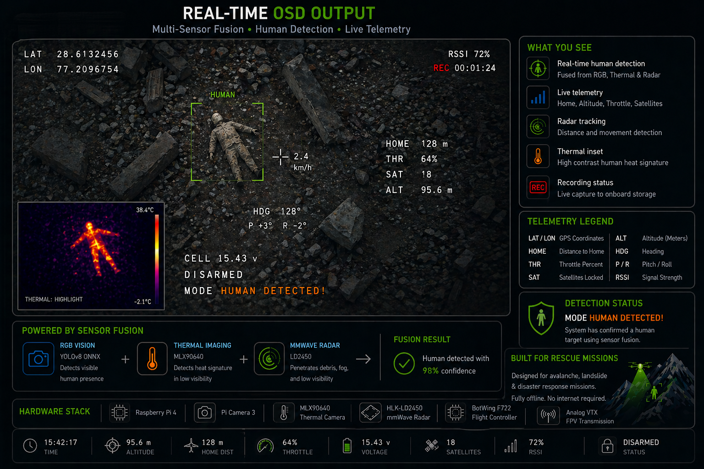
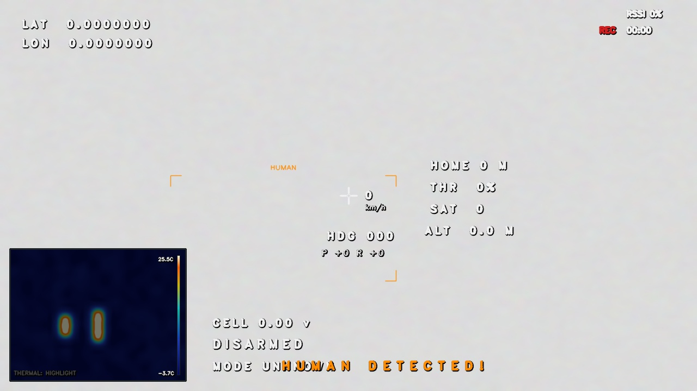
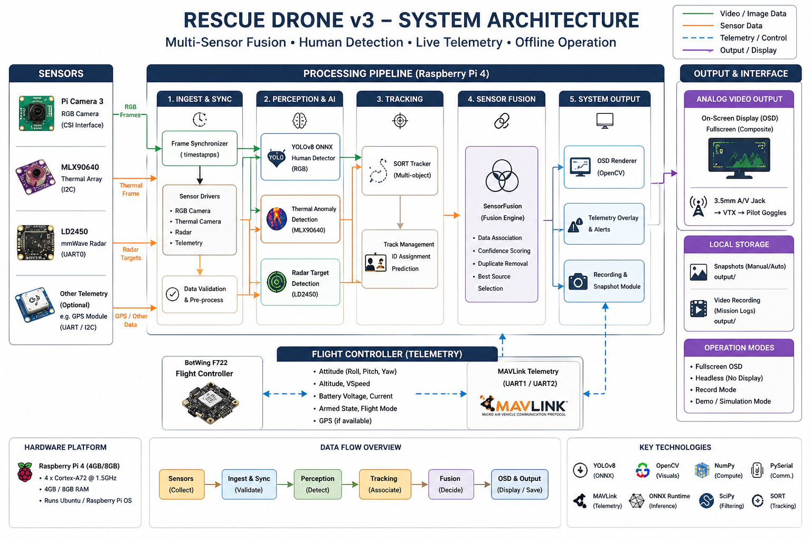
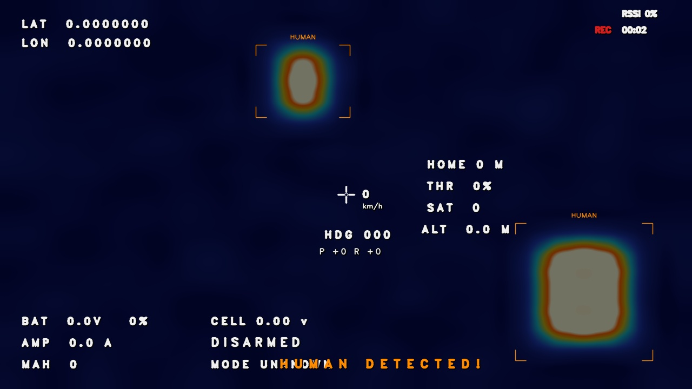
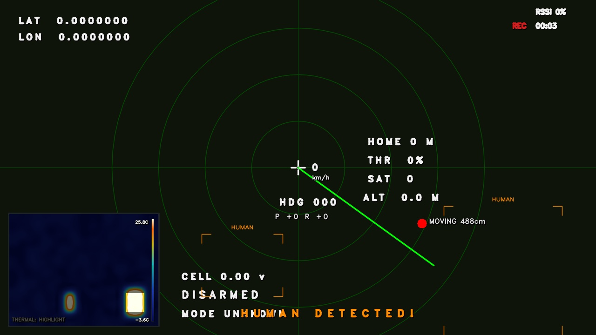

# 🚁 Rescue Drone v3 
**Avalanche & Landslide Autonomous Human Detection System**


<p align="center">
  
</p>

A high-performance, completely offline, multi-sensor fusion system designed to aid Search and Rescue operations by identifying human targets buried under snow or debris from an aerial perspective. 

It fuses **RGB visuals, Thermal Blob Anomalies, and mmWave Radar** to track and flag survivors, instantly projecting an augmented OSD (On-Screen Display) through an analog VTX to the pilot's goggles or laptop via an OTG receiver.

---

## 👥 Team

<table>
  <tr>
    <td align="center">
      <a href="https://github.com/asronal">
        <br><br>
        <b>Asronal</b>
      </a><br>
      <sub>Hardware Developer and Integrations</sub>
    </td>
    <td align="center">
      <a href="https://github.com/AnujD21">
        <br><br>
        <b>Anuj D</b>
      </a><br>
      <sub>Software Developer</sub>
    </td>
    <td align="center">
      <a href="https://github.com/vishal6626">
        <br><br>
        <b>Vishal</b>
      </a><br>
      <sub>Software Developer</sub>
    </td>
  </tr>
</table>

### 🎥 System Demo
<p align="center">
  <a href="https://github.com/asronal/SkyNetics-rescue-drone/raw/main/assets/demo.mp4">
    
  </a>
  <br>
  <em>Click the image above to download/watch the System Demo video</em>
</p>

---

## 🏗️ Project Architecture

<p align="center">
  
</p>

The architecture isolates the AI models, the visual UI, and the hardware interfaces into self-contained modules.

```text
rescue_drone_osd_fixed/
├── main.py                    # Primary entry point & execution loop
├── config.py                  # Centralized tuning: pinouts, thresholds, sizes
├── rescue_drone.service       # Linux systemd auto-boot background service
├── requirements.txt           # Python dependency tree
│
├── pipeline/                  
│   └── detection_pipeline.py  # Orchestrator: synchronizes sensors & AI every frame
│
├── display/                   
│   ├── rescue_display.py      # OpenCV Fullscreen UI (Main view config, PiP overlays)
│   └── osd.py                 # Telemetry rendering, bounding boxes, & radar scope
│
├── ml/                        
│   ├── models.py              # YOLO Detector + Anomaly Scan + SORT Tracker + Sensor Fusion
│   ├── thermal_isolation.py   # Background noise reduction for thermal arrays (contouring)
│   └── detection.py           # Universal Target Dataclass
│
├── sensors/                   
│   ├── rgb_camera.py          # Pi Cam 3 interface via libcamera
│   ├── thermal_camera.py      # MLX90640 I2C array decoding
│   ├── ld2450_radar.py        # UART stream parsing for LD2450 metrics
│   └── flight_controller.py   # MAVLink telemetry decoder bridging BotWing F722
│
├── models/                    # Storage for optimized .onnx weights (e.g. rgb_human.onnx)
└── output/                    # Destination for auto-snapshots and recorded videos
```

---

## 🔌 Hardware Wiring & Setup

### 1. Analog VTX Output (Composite Display)
To stream the fullscreen OSD directly to your pilot goggles, wire the Pi 4's 3.5mm TRRS Composite A/V Jack to your VTX.
* **Tip**: Audio Left
* **Ring 1**: Audio Right
* **Ring 2**: GND  `➔ Connect to VTX Ground`
* **Sleeve**: Video `➔ Connect to VTX Video-IN`

> **Note:** Raspberry Pi 4 disables composite video by default to save power. You **must** enable it:
> Edit `/boot/firmware/config.txt` and ensure you have:
> `enable_tvout=1`
> `sdtv_mode=2` (Use `2` for PAL, `0` for NTSC)

### 2. MLX90640 Thermal Sensor (I2C)
<p align="center">
  
</p>

* **VCC**  `➔` RPi Pin 1 (3.3V)
* **GND**  `➔` RPi Pin 6 (GND)
* **SDA**  `➔` RPi Pin 3 (GPIO 2, I2C1)
* **SCL**  `➔` RPi Pin 5 (GPIO 3, I2C1)

### 3. HLK-LD2450 mmWave Radar (UART0)
* **TX**   `➔` RPi Pin 10 (GPIO 15, UART0 RX)
* **RX**   `➔` RPi Pin 8  (GPIO 14, UART0 TX)
* **VCC**  `➔` RPi Pin 2  (5V)
* **GND**  `➔` RPi Pin 14 (GND)
> *Requires disabling RPi Bluetooth to free up UART0.*

### 4. BotWing F722 Flight Controller (UART1 or UART2)
* **F722 TX** `➔` RPi RX (e.g. GPIO 1 / Pin 28 for UART2)
* **F722 RX** `➔` RPi TX (e.g. GPIO 0 / Pin 27 for UART2)
* **GND**     `➔` Shared RPi GND
> *Ensure INav Ports tab has MSP enabled at 115200 baud for this UART.*

### 5. RPi Camera Module 3 (CSI)
* Connect via CSI ribbon cable to the primary `CAM` port on the Pi 4. The silver contacts on the ribbon should face the HDMI ports.

---

## 🛠️ Raspberry Pi Environment Setup

```bash
# 1. Update OS & Install system drivers
sudo apt update
sudo apt install -y python3-opencv python3-picamera2 python3-pip

# 2. Install required Python packages
pip3 install -r requirements.txt
pip3 install onnxruntime filterpy scipy pyserial
pip3 install adafruit-circuitpython-mlx90640 adafruit-blinka

# 3. Enable Performance Mode (Critical to prevent AI throttling)
sudo apt install cpufrequtils
sudo cpufreq-set -g performance

# 4. Verify Interfaces
i2cdetect -y 1                  # Should show 0x33 (MLX90640)
ls /dev/ttyAMA0                 # Should exist (LD2450)
libcamera-hello --list-cameras  # Should show IMX708 (Pi Cam 3)
```

---

## 🚀 Running the System

By default, the UI will launch in **Fullscreen Mode**, perfectly formatted to push out to your VTX without desktop borders. 

```bash
# Full Deployment on Drone (Fullscreen OSD)
python3 main.py

# Include FC MAVLink Alerts
python3 main.py --fc-enabled

# Desktop / VNC Testing (Windowed Mode)
python3 main.py --no-fullscreen

# Record the mission locally
python3 main.py --record

# Run in an SSH session (No Display Output)
python3 main.py --headless

# Test completely without hardware (Synthetic Data)
python3 main.py --demo
```

### Keyboard Shortcuts (If using VNC/Keyboard)
* **`V`** — Cycle Main Workspace View (RGB → Thermal → Radar)
* **`T`** — Toggle Thermal Picture-in-Picture Box
* **`M`** — Cycle Thermal Isolation Mode (Highlight / Silhouette / Contour)
* **`S`** — Save manual Snapshot to `output/` folder
* **`Q`** — Quit / Emergency Stop

---

## 📡 Radar Capabilities Note
<p align="center">
  
</p>

The integrated **LD2450** mmWave sensor excels at penetrative tracking.
* **Can Do:** Detect stationary sub-surface targets (like buried breathing survivors), trace moving targets through fog, and provide confidence metrics.
 * **Cannot Do:** XYZ positional point-clouds, visual imaging, or replace the primary thermal array. It is heavily weighted as a *presence confirmation* tool within the SensorFusion class.
