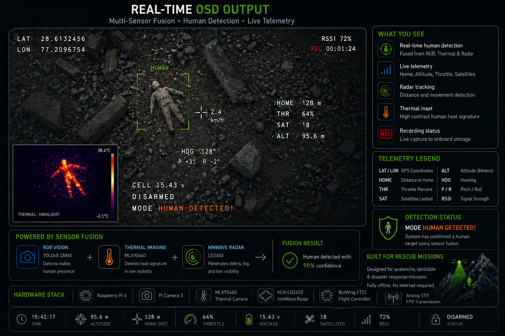
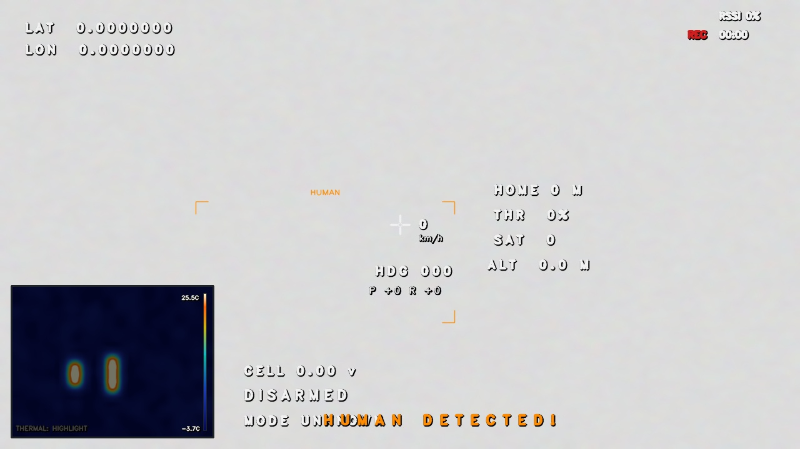
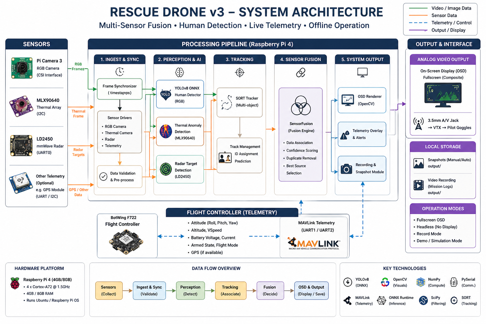
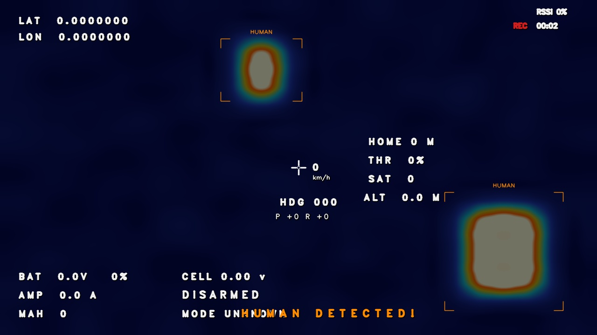
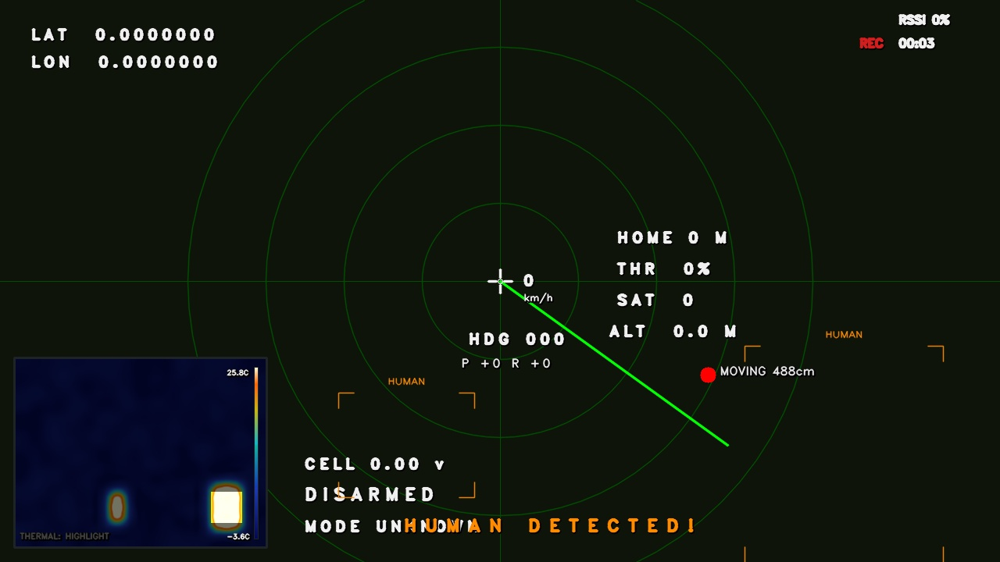

# 🚁 Rescue Drone v3
**Avalanche & Landslide Autonomous Human Detection System**


<p align="center">
  
</p>

This started as a project to answer a pretty grim question: *what happens to people buried in avalanches or landslides when rescuers can't safely reach them on foot?*

The answer we built is a drone that fuses **thermal imaging, mmWave radar, and RGB vision** to find survivors from the air — completely offline, no cloud dependency, running entirely on a Raspberry Pi 4. When it spots something, it projects a live augmented overlay through an analog VTX straight to the pilot's goggles.

---

## 👥 Team

<table>
  <tr>
    <td align="center">
      <a href="https://github.com/asronal">
        <br><br>
        <b>Asronal</b>
      </a><br>
      <sub>Hardware & Integrations</sub>
    </td>
    <td align="center">
      <a href="https://github.com/AnujD21">
        <br><br>
        <b>Anuj D</b>
      </a><br>
      <sub>Software</sub>
    </td>
    <td align="center">
      <a href="https://github.com/vishal6626">
        <br><br>
        <b>Vishal</b>
      </a><br>
      <sub>Model Training</sub>
    </td>
    <td align="center">
      <a href="https://github.com/Akilan12335">
        <br><br>
        <b>Akilan S</b>
      </a><br>
      <sub>Hardware Assembly</sub>
    </td>
  </tr>
</table>

### 🎥 System Demo

<p align="center">
  <a href="https://github.com/asronal/SkyNetics-rescue-drone/raw/main/assets/demo.mp4">
    
  </a>
  <br>
  <em>Click the image above to download/watch the System Demo video</em>
</p>

---

## 🏗️ How It's Structured

<p align="center">
  
</p>

We kept the AI models, the display layer, and the hardware drivers completely separate from each other. This made debugging a lot easier — if the thermal camera acts up, you don't have to dig through OSD code to fix it.

```text
rescue_drone_osd_fixed/
├── main.py                    # Entry point & main loop
├── config.py                  # All your tuning knobs live here — pinouts, thresholds, sizes
├── rescue_drone.service       # Systemd service for auto-boot on the Pi
├── requirements.txt           # Python dependencies
│
├── pipeline/                  
│   └── detection_pipeline.py  # Ties all sensors & AI together, frame by frame
│
├── display/                   
│   ├── rescue_display.py      # OpenCV fullscreen UI, PiP overlays
│   └── osd.py                 # Telemetry text, bounding boxes, radar scope rendering
│
├── ml/                        
│   ├── models.py              # YOLO detector, thermal anomaly scan, SORT tracker, sensor fusion
│   ├── thermal_isolation.py   # Strips background noise from thermal arrays
│   └── detection.py           # Shared Target dataclass used across the pipeline
│
├── sensors/                   
│   ├── rgb_camera.py          # Pi Cam 3 via libcamera
│   ├── thermal_camera.py      # MLX90640 I2C array reader & decoder
│   ├── ld2450_radar.py        # Parses the LD2450's UART data stream
│   └── flight_controller.py   # MAVLink telemetry from the BotWing F722
│
├── models/                    # Where your .onnx weights go (e.g. rgb_human.onnx)
└── output/                    # Auto-snapshots and recorded mission video land here
```

---

## 🔌 Wiring It Up

### 1. Analog VTX Output (Composite Video)

The Pi 4's 3.5mm TRRS jack carries composite video — wire it to your VTX and the OSD shows up in the pilot's goggles.

* **Tip**: Audio Left
* **Ring 1**: Audio Right
* **Ring 2**: GND `➔ VTX Ground`
* **Sleeve**: Video `➔ VTX Video-IN`

> **Heads up:** The Pi 4 disables composite output by default to save power. Open `/boot/firmware/config.txt` and add:
> ```
> enable_tvout=1
> sdtv_mode=2   # PAL — use 0 for NTSC
> ```

### 2. MLX90640 Thermal Sensor (I2C)

<p align="center">
  
</p>

* **VCC** `➔` Pin 1 (3.3V)
* **GND** `➔` Pin 6 (GND)
* **SDA** `➔` Pin 3 (GPIO 2, I2C1)
* **SCL** `➔` Pin 5 (GPIO 3, I2C1)

### 3. HLK-LD2450 mmWave Radar (UART0)

* **TX** `➔` Pin 10 (GPIO 15, UART0 RX)
* **RX** `➔` Pin 8  (GPIO 14, UART0 TX)
* **VCC** `➔` Pin 2  (5V)
* **GND** `➔` Pin 14 (GND)

> You'll need to disable Bluetooth on the Pi to free up UART0 for the radar.

### 4. BotWing F722 Flight Controller (UART1 or UART2)

* **F722 TX** `➔` RPi RX (GPIO 1 / Pin 28 for UART2)
* **F722 RX** `➔` RPi TX (GPIO 0 / Pin 27 for UART2)
* **GND** `➔` Shared GND

> In iNav, go to Ports and enable MSP on this UART at 115200 baud.

### 5. Pi Camera Module 3 (CSI)

Plug it into the primary `CAM` port with the ribbon cable's silver contacts facing the HDMI ports.

---

## 🛠️ Setting Up the Pi

```bash
# 1. Update and grab the system-level drivers
sudo apt update
sudo apt install -y python3-opencv python3-picamera2 python3-pip

# 2. Install Python packages
pip3 install -r requirements.txt
pip3 install onnxruntime filterpy scipy pyserial
pip3 install adafruit-circuitpython-mlx90640 adafruit-blinka

# 3. Lock the CPU to performance mode — skipping this will throttle the AI
sudo apt install cpufrequtils
sudo cpufreq-set -g performance

# 4. Sanity check your hardware
i2cdetect -y 1                  # Should show 0x33 for the MLX90640
ls /dev/ttyAMA0                 # Should exist if LD2450 is wired in
libcamera-hello --list-cameras  # Should list IMX708 (Pi Cam 3)
```

---

## 🚀 Running It

The default launch goes fullscreen — the display is tuned to fill composite output without any desktop chrome getting in the way.

```bash
# Standard flight deployment
python3 main.py

# With FC MAVLink telemetry
python3 main.py --fc-enabled

# Windowed mode for VNC / desktop testing
python3 main.py --no-fullscreen

# Record the mission to disk
python3 main.py --record

# SSH / headless — no display output
python3 main.py --headless

# No hardware? Use this to test with synthetic data
python3 main.py --demo
```

### Keyboard Shortcuts

Useful when you've got a keyboard or are connected over VNC:

* **`V`** — Cycle the main view (RGB → Thermal → Radar)
* **`T`** — Toggle the thermal picture-in-picture
* **`M`** — Cycle thermal isolation mode (Highlight / Silhouette / Contour)
* **`S`** — Save a snapshot to `output/`
* **`Q`** — Quit

---

## 📡 A Note on the Radar

<p align="center">
  
</p>

The **LD2450** is what makes this system interesting for avalanche scenarios. Unlike the camera sensors, it can detect stationary targets under snow — specifically by picking up the micro-movement of a person breathing. It also tracks through fog and smoke where the RGB camera is useless.

That said, it's not magic. It doesn't give you point-cloud data, it can't do visual imaging, and it's not a replacement for the thermal array. We use it as a *presence confirmation* layer inside the `SensorFusion` class — it bumps up confidence when the thermal or RGB detections are ambiguous.
